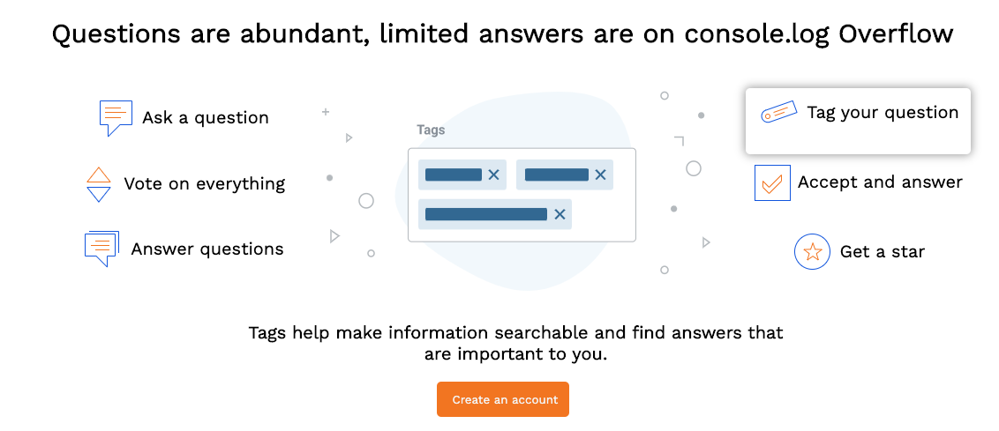
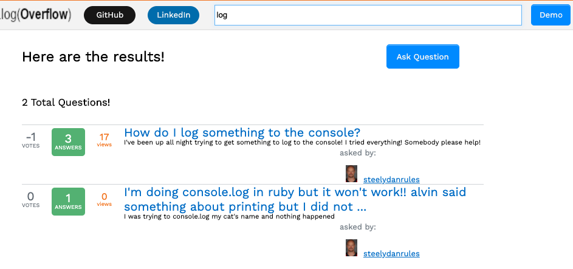

# README - console.log Overflow

**The Basics:**\
console.log Overflow is a clone of one of the most essential websites for any programmer: Stack Overflow. Similar to Stack Overflow, a user can create an account, post questions, post answers, vote on questions, search, & browse questions/answers. Feel free to create an account and post or browse (the very insightful questions) on my clone.

**Live Site:**\
https://console-log-overflow-aa.herokuapp.com/#/

**The Tech Used:**\
This clone was built using React-Redux on the frontend and Ruby-on-Rails & Postgres on the backend. 

**Dependencies**\
As seen in my package.json:

    "@babel/core": "^7.10.2",
    "@babel/preset-env": "^7.10.2",
    "@babel/preset-react": "^7.10.1",
    "babel-loader": "^8.1.0",
    "javascript-time-ago": "^2.0.7",
    "parcel": "^1.12.4",
    "react": "^16.13.1",
    "react-dom": "^16.13.1",
    "react-redux": "^7.2.0",
    "react-router-dom": "^5.2.0",
    "redux": "^4.0.5",
    "redux-logger": "^3.0.6",
    "redux-thunk": "^2.3.0",
    "webpack": "^4.43.0",
    "webpack-cli": "^3.3.11"

**Challenges**\
One difficulty was the splash page--there's a lot going on. Towards the bottom of the page, I wanted to have an image w/ text show/disappear depending on where the user clicks. I did this in React combined with some vanilla JS properties. When a picure is clicked, it finds the picture with that ID, changes the class to one with a property to show, and the one that is currently showing is changed to hidden. It allows for a smooth and seamless transition between images/text.

First, we place all of the images on the window.  The default image/text (1) is showing at first.

    

      <ul className="clickable-list-col-one-three" style={{ listStyle: "none" }}>
          <li onClick={() => this.changeQuestionsImage("1")}>
           Ask a question
        </li>    
          <li onClick={() => this.changeQuestionsImage("2")}>
           Vote on everything
        </li>    
          <li onClick={() => this.changeQuestionsImage("3")}>
           Answer questions
        </li>    
      </ul>

        
        
        
        
        
        

      <ul className="clickable-list-col-one-three" style={{ listStyle: "none" }}>
          <li onClick={() => this.changeQuestionsImage("4")}>
           Tag your question
        </li>    
          <li onClick={() => this.changeQuestionsImage("5")}>
           Accept and answer
        </li>    
          <li onClick={() => this.changeQuestionsImage("6")}>
           Get a star
        </li>    
      </ul>
    

The onClick function passes a number into this formula, telling our browser which image to show and which ones to hide.

    changeQuestionsImage(num){
      let oldImages = document.getElementsByClassName("question-main-image-change-shown")
      let oldImagesArray = Array.from(oldImages);
      oldImagesArray[0].className = "question-main-image-change-hidden"
      oldImagesArray[1].className = "question-main-image-change-hidden"

      let newImages = document.getElementById(`image-${num}`)
      newImages.className = "question-main-image-change-shown"

      let newBottom = document.getElementById(`bottom-text-${num}`)
      newBottom.className = "question-main-image-change-shown"
    }

Another difficulty was creating the search method. What I ended up doing was creating an if/else if statement on the questions index controller in order to allow for a searchData param. If a searchData param is passed into the controller, the app will query every question in the d/b and check if there is a matching string of text to the question's body. I made it so each question and answer would be downcase to avoid case-sensitive miss. The JSON sent back to the frontend will only be the questions with that matching string in any part of the body.

  def index
      if params`[:asker_id]`
        @questions = User.find(params`[:asker_id]`).questions

      elsif params[:searchData]
        @questions = []
        questions = Question.all
        questions.each do |question|

          if question.body.downcase.include?(params[:searchData].downcase)
            @questions.push(question)
          end 

        end

      else
        
        @questions = Question.all
      end

      render :index
    end

**Looking Ahead**\
I'm like to add tags in the future, as well as fake advertisements to give it the real Stack Overflow feel.

<!-- **W1D1:**

put on heroku

**W1D2:**

*USERAUTH*:
- make sure email/password is valid when signin UP and signing IN
- user cannot post unless logged in, but they'll be able to see the answers and browse the site
- new users will have a default display pic.  Users I create will have custom ones.  Not sure how to add prof pics.
- user display page: site.com/user1 (picture & are for links to Q's A's at the least by tomorrow) 

- top bar stays in place and allows a user to login/logout/view their own page <-- this is just to keep in mind,  would love to have this by wed.
topbar: links to my userpage, dropdown for settings, asked questions(bonus)

**W1D4:** 

*SEARCH FEATURE*:
- search feature(by NAME, QUESTION, ANSWER);
- page will render with links to each question/user

**WEEKEND**:

*STYLE*:
- make sure when you hover over upvote/downvote, it actually changes color
- userpage looks clean as well as the questions
- add a different class for tags, links, code 
- add some hover effects for links, the 

**W2D1:** 

*QUESTIONS/ANSWERS*:
- allow user to have questions, upvotes/downvotes, responses, responses to responses
- new answers will render without a refresh
- put a category on the question
- put add'l box for code snippets (make sure different font and color than the rest of the page)

**W2D3:** 

*SIDEBAR*:
- there will be links to "overflow blog" (I will replace this with "users with top karma" or something of that nature)
- filter search results by tags
- fake ads

**W2D4:** 
- hit on bonus and fix what doesn't work(sure there will be debugging) -->
